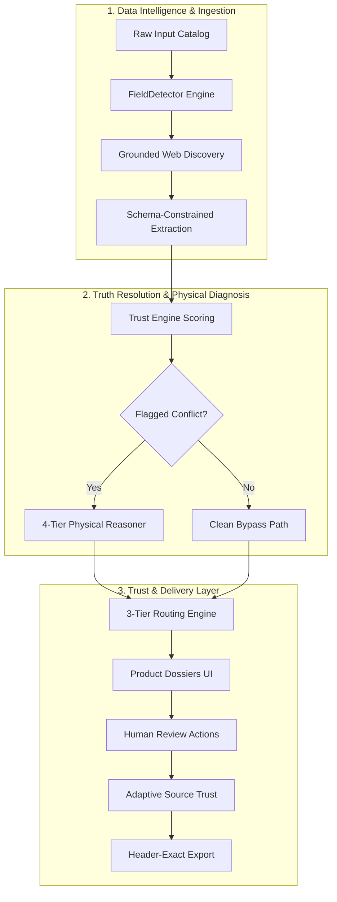

# SkuVeritas — Product Data Trust Engine & Dossier Platform

[](https://skuveritas.vercel.app)
[](https://github.com/ragavendram2007/SkuVeritas---Unihack)
[](https://fastapi.tiangolo.com)
[](https://reactjs.org)

**SkuVeritas** is a full-stack e-commerce catalog data trust engine built for high-scale catalog ingestion, truth resolution, physical conflict diagnosis, 3-tier risk routing, adaptive source trust learning, and downstream ERP export.

---

## 🏛 System Architecture



### End-to-End System Pipeline

```
+-----------------------------------------------------------------------------------------------+
|                                SKUVERITAS SYSTEM PIPELINE                                     |
+-----------------------------------------------------------------------------------------------+
|                                                                                               |
|  [ RAW CATALOG FILE ] ────> [ FIELD DETECTOR ] ────> [ GROUNDED DISCOVERY ] ──┐               |
|   (CSV / Excel / PDF)       (Content Inspection)      (0.90 / 0.85 / 0.60)    │               |
|                                                                               │               |
|  [ 252-COL EXPORT ] <──── [ ADAPTIVE TRUST ] <──── [ 3-TIER ROUTING ] <───────┘               |
|   (Target Schema)           (Trust Ledger Log)       (Auto / Flag / Block)                    |
|                                                                                               |
+-----------------------------------------------------------------------------------------------+
```

---

## ⚡ Quick Start & Running Locally

### Option 1: Single Command Demo Launcher (Windows)
Double-click `run_demo.bat` or execute in terminal:
```cmd
run_demo.bat
```
This automatically boots all 4 services, verifies health checks, and opens the **Product Dossier Dashboard** on `http://localhost:5174`.

### Option 2: Manual Start per Component

#### 1. Part 1 Data Intelligence Engine (Port 8000 & 5173)
```bash
# Backend (:8000)
cd backend
python run.py

# Frontend (:5173)
cd frontend
npm run dev
```

#### 2. Part 2 Trust & Delivery Layer (Port 8001 & 5174)
```bash
# Backend (:8001)
cd backend_part2
python run.py

# Frontend (:5174)
cd frontend_part2
npm run dev
```

---

## 🛡 Non-Hardcoding & Evaluation Compliance Proofs

- **Zero Hardcoded Branching**: All ingestion, field detection, matching, and diagnosis run dynamically via content patterns without literal SKU or manufacturer string checks...
- **Header-Exact Preservation**: 252 output columns are loaded dynamically from `expected_output.xlsx` at runtime.
- **Altered Dataset Test Suite**: Tested against `sample_dataset_altered.xlsx` (renamed headers, dropped fields, reordered columns, and novel product categories like Solar Inverters and Hydraulic Pumps).
- **Test Suite Results**:
  - `backend/tests/`: **11 / 11 PASSED**
  - `backend_part2/tests/`: **5 / 5 PASSED**

---

## 🚀 Production Deployment

The SkuVeritas platform is deployed and live on Vercel:

| Deployment Component | Environment | Live URL | OpenAPI Swagger Docs |
| :--- | :--- | :--- | :--- |
| 🌐 **Production Web Application** | Vercel Cloud | [https://skuveritas.vercel.app](https://skuveritas.vercel.app) | [https://skuveritas.vercel.app/docs](https://skuveritas.vercel.app/docs) |
| 📁 **GitHub Source Repository** | GitHub | [https://github.com/ragavendram2007/SkuVeritas---Unihack](https://github.com/ragavendram2007/SkuVeritas---Unihack) | — |
| ⚙️ **Part 1 Data API** | Local Dev | `http://localhost:8000` | `http://localhost:8000/docs` |
| ⚙️ **Part 2 Trust API** | Local Dev | `http://localhost:8001` | `http://localhost:8001/docs` |

---

## 👥 Contributors & Documentation
- Complete System Walkthrough: [`walkthrough.md`](file:///C:/Users/Ragavendra%20M/.gemini/antigravity/brain/76339991-92f5-4ca8-b2bf-df762fc32cea/walkthrough.md)
- Primary Developer / Repository Owner: [@ragavendram2007](https://github.com/ragavendram2007)
